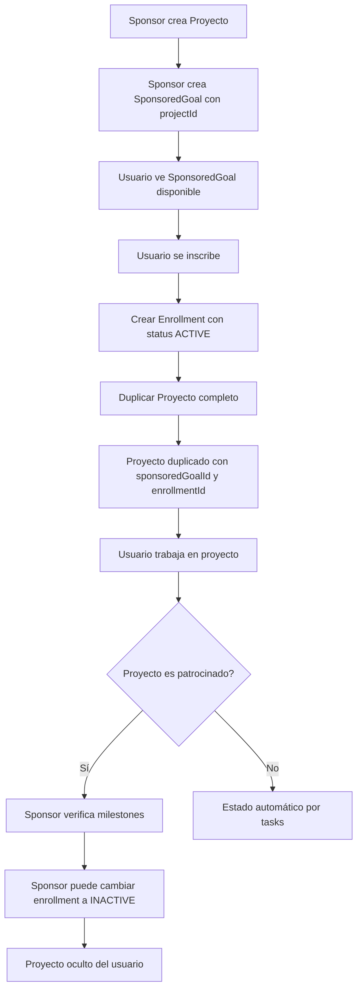

# Actualización EnrollmentStatus y SponsoredGoal como Proyecto

## Resumen de Cambios

Esta actualización transforma el sistema de SponsoredGoals para que funcionen como proyectos completos y simplifica el flujo de inscripciones eliminando estados innecesarios.

## 1. Actualización de EnrollmentStatus

### 1.1 Modificar Enum EnrollmentStatus

- **Archivo**: `src/shared/types/enums.ts`
- Eliminar `PENDING = 'pending'` y `REJECTED = 'rejected'`
- Mantener solo: `ACTIVE = 'active'`, `INACTIVE = 'inactive'`, `COMPLETED = 'completed'`
- Actualizar comentarios del enum

### 1.2 Actualizar SponsorEnrollmentOrmEntity

- **Archivo**: `src/modules/sponsored-goals/infrastructure/persistence/sponsor-enrollment.orm-entity.ts`
- Cambiar default de `EnrollmentStatus.PENDING` a `EnrollmentStatus.ACTIVE`
- Actualizar comentarios

### 1.3 Actualizar casos de uso de inscripción

- **Archivo**: `src/modules/sponsored-goals/application/use-cases/enroll-in-sponsored-goal.use-case.ts` (crear si no existe)
- Las inscripciones siempre se crean con status `ACTIVE`
- Eliminar cualquier lógica de activación manual

## 2. Relación SponsoredGoal con Project

### 2.1 Agregar campo projectId a SponsoredGoal

- **Archivo**: `src/modules/sponsored-goals/infrastructure/persistence/sponsored-goal.orm-entity.ts`
- Agregar columna `project_id` (UUID, nullable: false, FK a projects.id)
- Agregar relación `@ManyToOne` con `ProjectOrmEntity`
- **Archivo**: `src/modules/sponsored-goals/domain/entities/sponsored-goal.entity.ts`
- Agregar campo `projectId: string` al constructor

### 2.2 Actualizar CreateSponsoredGoalDto

- **Archivo**: `src/modules/sponsored-goals/application/dto/create-sponsored-goal.dto.ts`
- Agregar campo `projectId: string` (requerido, UUID)
- Validar que el proyecto existe y pertenece al sponsor

### 2.3 Actualizar CreateSponsoredGoalUseCase

- **Archivo**: `src/modules/sponsored-goals/application/use-cases/create-sponsored-goal.use-case.ts`
- Validar que el `projectId` existe
- Validar que el proyecto pertenece al sponsor (userId)
- Validar que el proyecto tiene milestones, sprints y tasks
- Incluir `projectId` al crear la entidad

## 3. Proyecto Duplicado al Inscribirse

### 3.1 Agregar campos a Project para rastrear origen patrocinado

- **Archivo**: `src/modules/projects/infrastructure/persistence/project.orm-entity.ts`
- Agregar `sponsored_goal_id` (UUID, nullable, FK a sponsored_goals.id)
- Agregar `enrollment_id` (UUID, nullable, FK a sponsor_enrollments.id)
- Agregar `is_active` (boolean, default: true) - para controlar visibilidad cuando enrollment está INACTIVE
- **Archivo**: `src/modules/projects/domain/entities/project.entity.ts`
- Agregar campos opcionales: `sponsoredGoalId?: string`, `enrollmentId?: string`, `isActive?: boolean`

### 3.2 Crear caso de uso para duplicar proyecto

- **Archivo**: `src/modules/sponsored-goals/application/use-cases/duplicate-sponsored-project.use-case.ts` (nuevo)
- Recibir `sponsoredGoalId` y `userId`
- Obtener el proyecto original del SponsoredGoal
- Duplicar el proyecto con todos sus elementos:
  - Crear nuevo proyecto con `sponsoredGoalId` y `enrollmentId`
  - Duplicar todas las milestones (con estados iniciales: pending)
  - Duplicar todos los sprints de cada milestone
  - Duplicar todas las tasks de cada sprint (con estados iniciales)
- Retornar el proyecto duplicado

### 3.3 Integrar duplicación en caso de inscripción

- **Archivo**: `src/modules/sponsored-goals/application/use-cases/enroll-in-sponsored-goal.use-case.ts`
- Crear `SponsorEnrollment` con status `ACTIVE`
- Llamar a `DuplicateSponsoredProjectUseCase` para crear el proyecto duplicado
- Asociar el `enrollmentId` al proyecto duplicado

## 4. Filtrado de Proyectos por Estado de Enrollment

### 4.1 Actualizar GetUserProjectsUseCase

- **Archivo**: `src/modules/projects/application/use-cases/get-user-projects.use-case.ts`
- Filtrar proyectos donde:
  - `sponsoredGoalId IS NULL` (proyectos personales siempre visibles), O
  - `sponsoredGoalId IS NOT NULL AND isActive = true` (proyectos patrocinados activos)
- Esto excluye proyectos con enrollment INACTIVE

### 4.2 Actualizar ProjectRepository

- **Archivo**: `src/modules/projects/infrastructure/persistence/project.repository.impl.ts`
- Modificar `findByUserId` para incluir el filtro de `isActive`
- Considerar también el estado del enrollment si es necesario

## 5. Gestión de Estado de Enrollment por Sponsor

### 5.1 Crear caso de uso para cambiar estado de enrollment

- **Archivo**: `src/modules/sponsored-goals/application/use-cases/update-enrollment-status.use-case.ts` (nuevo)
- Validar que el sponsor es dueño del SponsoredGoal
- Permitir cambiar de `ACTIVE` a `INACTIVE` o viceversa
- Cuando se cambia a `INACTIVE`, actualizar `isActive = false` en el proyecto asociado
- Cuando se cambia a `ACTIVE`, actualizar `isActive = true` en el proyecto asociado

### 5.2 Agregar endpoint en controlador

- **Archivo**: `src/modules/sponsored-goals/presentation/sponsored-goals.controller.ts`
- Agregar `PATCH /sponsored-goals/:goalId/enrollments/:enrollmentId/status`
- Body: `{ status: 'active' | 'inactive' }`
- Solo accesible por el sponsor dueño

### 5.3 Caso de uso y endpoint para listar proyectos de usuario por email

- **Archivo**: `src/modules/sponsored-goals/presentation/sponsored-goals.controller.ts`
- Agregar `GET /sponsored-goals/user-projects?email={email}`
- Query parameter: `email` (requerido)
- Retornar lista de proyectos del usuario que fueron creados por el sponsor (solo proyectos patrocinados del sponsor)
- Solo accesible por el sponsor autenticado
- Usar `GetUserSponsoredProjectsUseCase` para obtener los proyectos

## 6. Estado de Milestones

### 6.1 Agregar campo status a Milestone

- **Archivo**: `src/modules/milestones/infrastructure/persistence/milestone.orm-entity.ts`
- Agregar columna `status` (enum: 'pending', 'in_progress', 'completed', default: 'pending')
- **Archivo**: `src/modules/milestones/domain/entities/milestone.entity.ts`
- Agregar campo `status: string` al constructor

### 6.2 Crear enum MilestoneStatus

- **Archivo**: `src/shared/types/enums.ts`
- Agregar enum `MilestoneStatus` con valores: `PENDING = 'pending'`, `IN_PROGRESS = 'in_progress'`, `COMPLETED = 'completed'`

### 6.3 Lógica automática de estado de milestones

- **Archivo**: `src/modules/milestones/application/use-cases/update-milestone-status.use-case.ts` (nuevo o modificar existente)
- El estado de las milestones se actualiza automáticamente basado en el progreso de las tasks:
  - `PENDING`: Cuando ninguna task está completada
  - `IN_PROGRESS`: Cuando hay al menos una task completada (pero no todas)
  - `COMPLETED`: 
    - En proyectos personales: Cuando todas las tasks están completadas (automático)
    - En proyectos patrocinados: Cuando el sponsor verifica manualmente usando el endpoint (ver 6.4)
- Esta lógica aplica tanto para proyectos personales como patrocinados
- El usuario es quien marca las tasks como completadas en ambos casos
- Nota: En proyectos patrocinados, el estado puede ser cambiado manualmente a `COMPLETED` por el sponsor incluso si no todas las tasks están completadas (ver punto 6.4)

### 6.4 Caso de uso para sponsor cambiar milestone a completada

- **Archivo**: `src/modules/sponsored-goals/application/use-cases/verify-milestone-completion.use-case.ts` (nuevo)
- Validar que el sponsor es dueño del SponsoredGoal
- Validar que el proyecto pertenece a un usuario inscrito en ese SponsoredGoal
- Cambiar el estado de la milestone a `COMPLETED` (método MANUAL)
- El sponsor verifica que las tasks fueron realizadas (el usuario las marca como completadas) y usa este endpoint para dar la milestone como completada
- Crear registro en `VerificationEvent` para auditoría
- Nota: Solo se implementa el método MANUAL. El sponsor usa su propio software o verifica en la aplicación y luego llama al endpoint para cambiar el estado.

### 6.5 Endpoint para verificación de milestone

- **Archivo**: `src/modules/sponsored-goals/presentation/sponsored-goals.controller.ts`
- Agregar `POST /sponsored-goals/:goalId/projects/:projectId/milestones/:milestoneId/verify`
- Body: `{ }` (sin parámetros, siempre usa método MANUAL)
- Solo accesible por el sponsor dueño
- Cambia el estado de la milestone a `COMPLETED`

## 7. Actualizaciones de Mappers y DTOs

### 7.1 Actualizar mappers

- **Archivo**: `src/modules/sponsored-goals/infrastructure/mappers/sponsored-goal.mapper.ts`
- Incluir `projectId` en el mapeo
- **Archivo**: `src/modules/projects/infrastructure/mappers/project.mapper.ts`
- Incluir `sponsoredGoalId`, `enrollmentId`, `isActive` en el mapeo
- **Archivo**: `src/modules/milestones/infrastructure/mappers/milestone.mapper.ts`
- Incluir `status` en el mapeo

### 7.2 Actualizar DTOs de respuesta

- **Archivo**: `src/modules/sponsored-goals/application/dto/sponsored-goal-response.dto.ts`
- Agregar `projectId: string`
- **Archivo**: `src/modules/projects/application/dto/project-response.dto.ts`
- Agregar campos opcionales: `sponsoredGoalId?`, `enrollmentId?`, `isActive?`
- **Archivo**: `src/modules/milestones/application/dto/milestone-response.dto.ts`
- Agregar `status: string`

## 8. Repositorios y Consultas

### 8.1 Actualizar repositorios

- **Archivo**: `src/modules/sponsored-goals/domain/repositories/sponsored-goal.repository.ts`
- Agregar método `findByProjectId(projectId: string): Promise<SponsoredGoal | null>`
- **Archivo**: `src/modules/sponsored-goals/infrastructure/persistence/sponsored-goal.repository.impl.ts`
- Implementar `findByProjectId`
- **Archivo**: `src/modules/projects/domain/repositories/project.repository.ts`
- Agregar método `findByEnrollmentId(enrollmentId: string): Promise<Project | null>`
- Agregar método `findByUserEmailAndSponsor(email: string, sponsorId: string): Promise<Project[]>` - Para buscar proyectos de un usuario por email, solo los patrocinados por el sponsor
- **Archivo**: `src/modules/projects/infrastructure/persistence/project.repository.impl.ts`
- Implementar `findByEnrollmentId`
- Implementar `findByUserEmailAndSponsor` - Buscar usuario por email, luego filtrar proyectos donde `sponsoredGoalId` existe y el SponsoredGoal pertenece al sponsorId

### 8.2 Caso de uso para listar proyectos de usuario por email

- **Archivo**: `src/modules/sponsored-goals/application/use-cases/get-user-sponsored-projects.use-case.ts` (nuevo)
- Recibir `email: string` y `sponsorUserId: string`
- Usar `IUserRepository.findByEmail(email)` para buscar el usuario
- Obtener el `sponsorId` del sponsorUserId
- Obtener proyectos del usuario usando `IProjectRepository.findByUserEmailAndSponsor(email, sponsorId)`
- Filtrar proyectos donde:
  - `sponsoredGoalId IS NOT NULL` (solo proyectos patrocinados)
  - El `sponsoredGoalId` corresponde a un SponsoredGoal del sponsor
- Retornar lista de proyectos con sus milestones
- Nota: El sponsor solo verá proyectos patrocinados que él creó y a los que el usuario se inscribió. No verá proyectos personales del usuario ni proyectos de otros sponsors.

## 9. Migraciones de Base de Datos

### 9.1 Crear migración para EnrollmentStatus

- Actualizar valores existentes de `PENDING` a `ACTIVE`
- Actualizar valores existentes de `REJECTED` a `INACTIVE`
- Modificar el enum en la base de datos

### 9.2 Crear migración para Project

- Agregar columnas: `sponsored_goal_id`, `enrollment_id`, `is_active`
- Agregar FKs y índices apropiados

### 9.3 Crear migración para SponsoredGoal

- Agregar columna `project_id`
- Agregar FK a projects

### 9.4 Crear migración para Milestone

- Agregar columna `status` con enum y default 'pending'

## 10. Validaciones y Reglas de Negocio

### 10.1 Validaciones en CreateSponsoredGoal

- El proyecto debe tener al menos una milestone
- Cada milestone debe tener al menos una task
- El proyecto debe pertenecer al sponsor
- El proyecto no debe estar ya asociado a otro SponsoredGoal

### 10.2 Validaciones en inscripción

- Verificar cupo disponible (`maxUsers`)
- Verificar que el usuario no está ya inscrito
- Verificar que el SponsoredGoal está activo (fechas válidas)

### 10.3 Validaciones en cambio de estado de enrollment

- Solo el sponsor dueño puede cambiar el estado
- No se puede cambiar a estados eliminados (PENDING, REJECTED)

## Diagrama de Flujo

## Archivos Principales a Modificar

1. `src/shared/types/enums.ts` - Actualizar EnrollmentStatus, agregar MilestoneStatus
2. `src/modules/sponsored-goals/infrastructure/persistence/sponsored-goal.orm-entity.ts` - Agregar projectId
3. `src/modules/projects/infrastructure/persistence/project.orm-entity.ts` - Agregar campos de rastreo
4. `src/modules/milestones/infrastructure/persistence/milestone.orm-entity.ts` - Agregar status
5. `src/modules/sponsored-goals/application/use-cases/enroll-in-sponsored-goal.use-case.ts` - Lógica de inscripción automática
6. `src/modules/sponsored-goals/application/use-cases/duplicate-sponsored-project.use-case.ts` - Duplicar proyecto
7. `src/modules/sponsored-goals/application/use-cases/update-enrollment-status.use-case.ts` - Cambiar estado enrollment
8. `src/modules/sponsored-goals/application/use-cases/verify-milestone-completion.use-case.ts` - Verificación por sponsor (método MANUAL)
9. `src/modules/sponsored-goals/application/use-cases/get-user-sponsored-projects.use-case.ts` - Listar proyectos de usuario por email
10. `src/modules/projects/application/use-cases/get-user-projects.use-case.ts` - Filtrar proyectos inactivos
11. `src/modules/projects/infrastructure/persistence/project.repository.impl.ts` - Agregar findByUserEmailAndSponsor
12. `src/modules/milestones/application/use-cases/update-milestone-status.use-case.ts` - Lógica automática/personal
13. `src/modules/sponsored-goals/application/use-cases/create-sponsored-goal.use-case.ts` - Validar que cada milestone tenga al menos una task